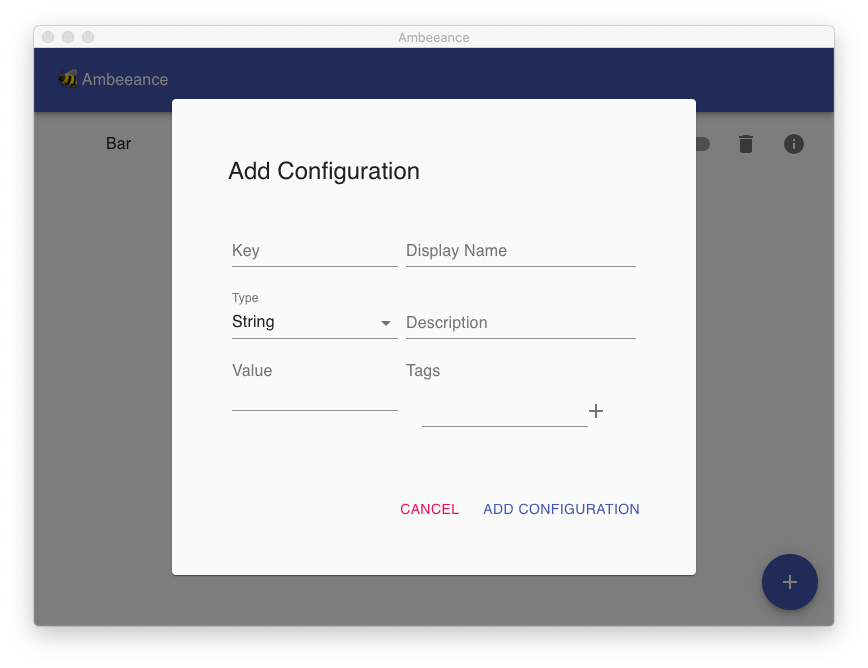
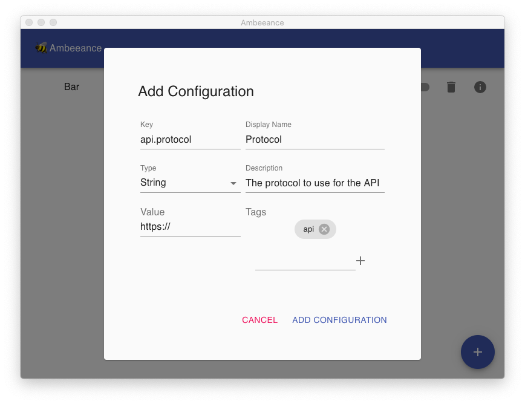
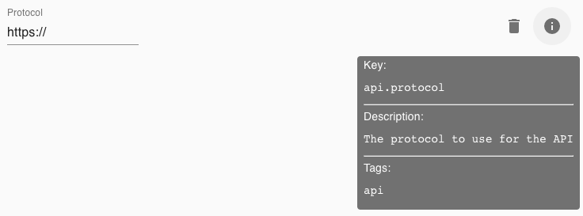
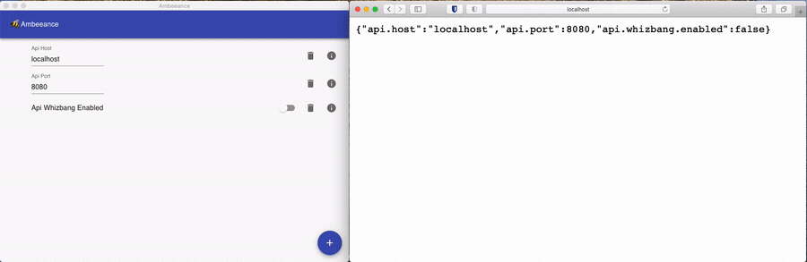
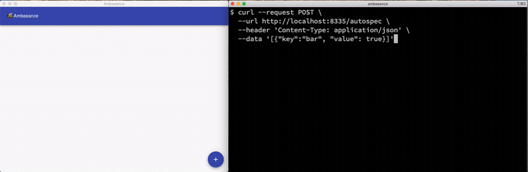
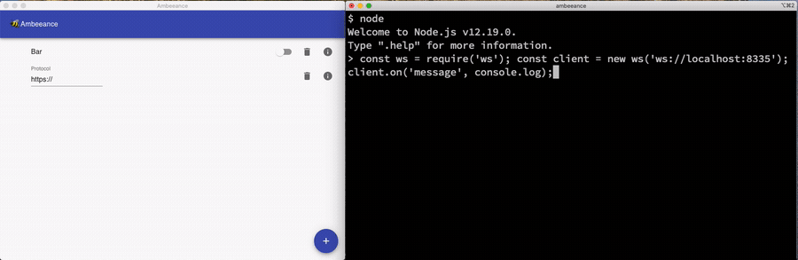
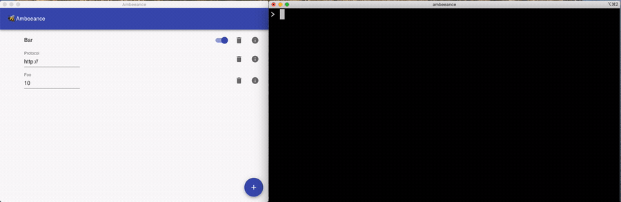

    
    <h1>Ambeeance</h1>

Ambeeance is a tool to provide configuration to your application at runtime
during development.
You can change the config using the GUI and those changes will be dynamically reflected in the JSON blob the service
returns.

The tool is currently functional but is pre-release, you may run into unexpected behaviour if you stray from the happy
path. You can build from source on your own machine or you can get a [pre-release build](https://github.com/Ambeeance/ambeeance/actions/workflows/prerelease.yml) from the latest commit to `develop`.

## Features

### Managing Configuration (Manual)
From the main screen you can click the + button to bring up the 'Add Configuration' dialog. You can select between 'String', 'Switch' and 'Number' for the type of the value and provide a key name for the configuration element. All other fields are optional and a display name will be generated from your key if you do not provide one.

Tags are intended to provide easy searching and filtering in the future although you can review the tags set on a config element using the info icon in the main screen.

You can manipulate the values of the config directly from the main screen then retrieve the config via an HTTP GET request to the server which is hosted at `http://localhost:8335` by default.

### Managing Configuration (Auto Spec)
Since your application will typically already have the schema of the configuration object it needs to receive a programmatic interface for automatically specifying config is provided. This allows your application to pass the existing keys and values to Ambeeance at startup alleviating the requirement for any manual configuration.

### Websockets
It should be relatively easy to create a poll based client library which uses the HTTP interface in practically any technology stack. If your environment supports it you can also make use of an event driven websocket interface to trigger configuration updates only when the Ambeeance config has been changed.

Websockets can also be used to autospec new configuration elements

## Clients
It's not envisioned that developers will write Ambeeance specific code into their apps but instead clients should be developed to conditionally pass control of configuration objects to Ambeeance in development environments.
* [ambeeance-client](https://github.com/ambeeance/client) - a Websocket based node.js client which autospecs the fields of an object and then overrides the fields when updates are published from the server.

## Demos
* [abeeance-example-app](https://github.com/ambeeance/example-app) - A tiny [express](https://github.com/expressjs/express) application which retrieves information from [swapi](https://swapi.dev), if you run it with `AMBEEANCE=ENABLED` in your environment then the ambeeance-client will attempt to connect to your local Ambeeance instance.
